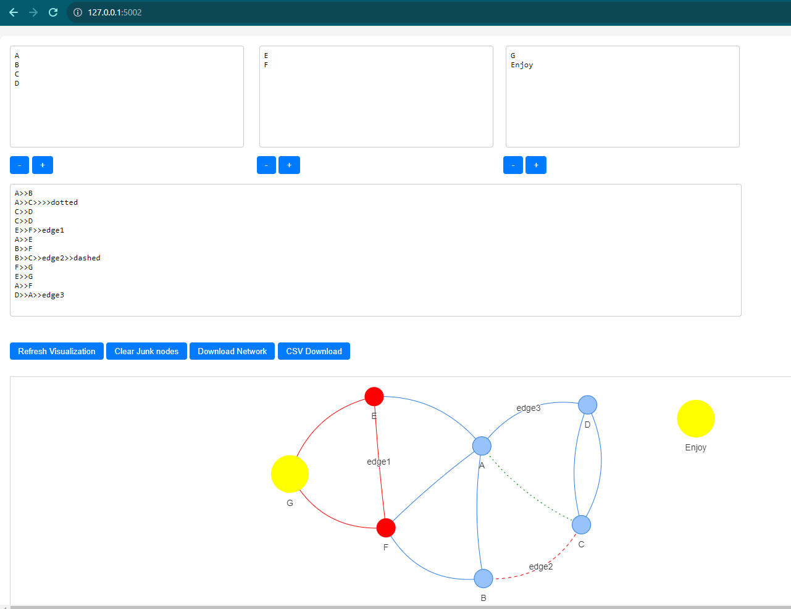

# NetVisualizationkit

### OverviewOverview

Designed for Windows, this tool offers a comprehensive solution for network visualization, harnessing the power of the vis-network and d3 libraries. It allows users to define nodes and edges, tailor node aesthetics by adjusting colors and sizes, and then showcase the network interactively on a web interface.

### Installation
Unzip the repository into your desired directory.

### How to Use
* Start the server by running Visualizationkit.exe.
* Enter the desired port number or use the default (5002).
* Open a web browser and navigate to http://localhost:<port_number>/.
* Input node and edge data in the provided fields.
* Click on the "Visualize" button to see the network visualization.

Screenshot
---------


### Edge Format:
In this project, edges are represented using the following format:

```node1_ID>>node2_ID>>Edge_Label>>Edge_Style```

#### Edge Styles:
* dashed: Represents the edge with a dashed line in red color.
* dotted: Represents the edge with a dotted pattern.
